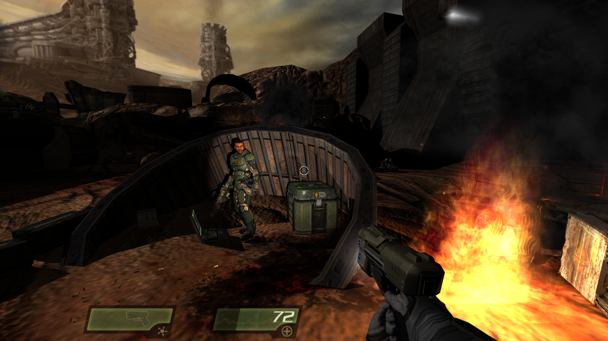
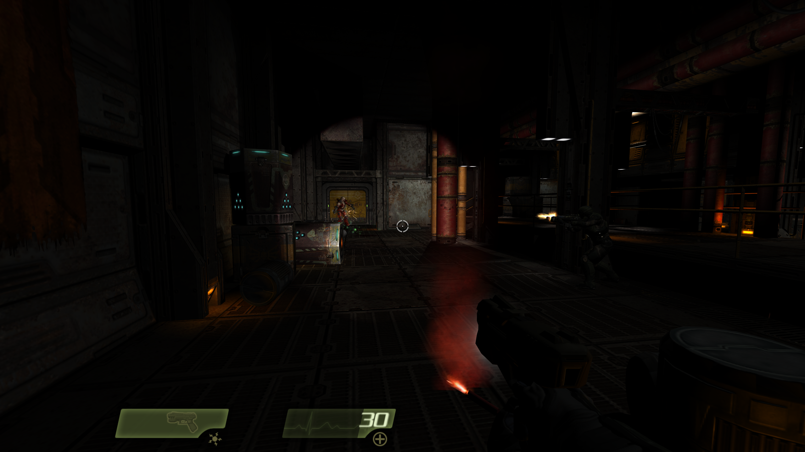

<div align="center">


[](https://www.gnu.org/licenses/gpl-3.0)
[](https://github.com/themuffinator/OpenQ4)
[](https://github.com/themuffinator/OpenQ4)
[](https://github.com/themuffinator/OpenQ4)
[](https://mesonbuild.com/)

**Modern systems support, quality-of-life improvements, rendering upgrades, and new features for Quake 4**

[Features](#features) • [Compatibility](#quake-4-compatibility-status) • [Installation](#installation) • [Building](BUILDING.md) • [Documentation](#documentation) • [TODO](TODO.md) • [Credits](#credits)

</div>

---

<p align="center">
  <a href="https://store.steampowered.com/app/2210/Quake_4/" target="_blank" rel="noopener noreferrer" aria-label="Purchase Quake 4 on Steam"></a>
  &nbsp;&nbsp;
  <a href="https://www.gog.com/game/quake_iv" target="_blank" rel="noopener noreferrer" aria-label="Purchase Quake 4 on GOG"></a>
</p>

---

## About

**OpenQ4** is a complete open-source replacement for the Quake 4 engine and game binaries, built on the foundation of [Quake4Doom](https://github.com/idSoftware/Quake4Doom). Its goal is to bring modern systems support, quality-of-life improvements, visual enhancements, and new features to Quake 4 — while keeping full compatibility with the original game assets and preserving the classic gameplay feel.

Current work includes HDR rendering with filmic tone mapping on FP16 targets, bloom, SSAO, CRT emulation, full controller support, automatic aspect-ratio handling, multi-monitor support, and an experimental shadow-mapping pipeline with projected/point-light maps, cascaded shadow maps (CSM), alpha-tested transparency shadows, and optional translucent shadowing.

> [!NOTE]
> **OpenQ4 does not include game assets.** You must own a legitimate copy of Quake 4. The engine automatically detects your installation from Steam or GOG. OpenQ4 is not compatible with legacy Quake 4 game mods.

---

<p align="center">
  
</p>
<p align="center"><sub>OpenQ4 running with stock Quake 4 assets.</sub></p>

---

## Installation

### What You Need

- A **legitimate copy of Quake 4** — [Steam](https://store.steampowered.com/app/2210/Quake_4/) or [GOG](https://www.gog.com/game/quake_iv)
- The **latest OpenQ4 release** from the [Releases page](https://github.com/themuffinator/OpenQ4/releases)
- A modern **64-bit operating system** (Windows, Linux, or macOS)

### Steps

1. **Install Quake 4** via Steam or GOG (if you haven't already)
2. **Download** the latest OpenQ4 release archive for your platform
3. **Extract** the archive to a folder of your choice
4. **Run** `OpenQ4-client_x64` (`.exe` on Windows)

The engine will automatically find your Quake 4 installation and validate the game files. No manual path configuration is needed in most setups.

> [!NOTE]
> **Windows packages are self-contained** — no separate Visual C++ Redistributable or OpenAL install is required.

> [!NOTE]
> **Linux users:** The runtime currently uses an X11/GLX path. On Wayland desktops, run OpenQ4 through XWayland (`DISPLAY` must be available).

### Manual Path Configuration (optional)

If your Quake 4 installation is not auto-detected, launch with:

```
OpenQ4-client_x64 +set fs_basepath "C:\path\to\Quake 4"
```

---

## Features

<p align="center">
  
  
</p>
<p align="center"><sub>Modern rendering upgrades running with original Quake 4 assets.</sub></p>

### Visual Enhancements

- **HDR Pipeline**: FP16 scene and post-process targets with filmic tone mapping and color controls (exposure, contrast, saturation, vibrance)
- **Bloom**: Tunable separable half-resolution bloom for stronger highlights with lower full-screen cost
- **Shadow Mapping** *(experimental)*: Projected and point-light shadow maps, projected-light cascaded shadow maps (CSM), alpha-tested transparency shadows, and optional translucent shadow accumulation
- **SSAO**: Screen-space ambient occlusion for added depth and contact shadowing
- **CRT Emulation**: Optional post-process with scanlines, phosphor mask, screen curvature, and chromatic aberration controls
- **Modern AA**: MSAA and official SMAA 1x (medium preset) for cleaner output across a wide range of hardware
- **Resolution Scaling and Supersampling**: Internal render-fraction controls with menu-exposed supersample-style presets; high-quality upscale and sharpening paths for image-quality tuning

### Display and Controls

- **Controller Support**: Full gamepad/joystick support with hotplug, dual-stick analog movement and look, and complete button mapping
- **Automatic Aspect-Ratio Management**: UI, FOV, zoom behavior, and view-weapon framing adapt from live render size — no manual aspect-ratio toggles needed
- **Multi-Monitor Support**: Target specific displays, auto-detect the active monitor, and keep window/UI behavior sane across modern desktop setups
- **Modern Display Modes**: Fullscreen, borderless windowed, exclusive fullscreen, and desktop-native fullscreen paths
- **Responsive UI**: Interface scaling and layout that hold up on 4:3, widescreen, ultrawide, and multi-screen environments

### Engine and Platform

- **Full Game Support**: Complete single-player campaign and multiplayer modes in one unified engine stack
- **Stock Asset Compatibility**: Designed to run against official Quake 4 PK4s — no replacement content shipped
- **Auto-Discovery**: Smart Steam/GOG detection and official asset checksum validation at startup
- **SDL3 Backend**: Modern cross-platform input, windowing, and display handling
- **Audio**: WAV and Ogg Vorbis support via [OpenAL Soft](https://openal-soft.org/)
- **Crash Diagnostics**: Automatic crash dumps and structured logs for easier debugging

---

## Quake 4 Compatibility Status

This status reflects compatibility with official Quake 4 assets (`q4base` PK4s), not proprietary game DLL compatibility.

### Compatible

- ✅ **Basic Set of Effects (BSE) Reconstruction**: Core BSE runtime behavior rebuilt and integrated so stock effects execute through the OpenQ4 engine/game pipeline
- ✅ **Sound Shaders**: Effect-driven sound shader paths restored, including effect sound capability checks and runtime playback behavior
- ✅ **Screen Effects**: BSE-driven screen/camera effect paths used by stock content are operational
- ✅ **Material Shaders**: Material handling compatibility restored to remove startup reliance on custom `q4base` material overrides
- ✅ **Modern Display Handling**: Automatic aspect-ratio/FOV behavior, multi-monitor targeting, and desktop-native fullscreen paths integrated
- ✅ **Stock-Asset Validation Path**: Repeated validation loops with stock assets keep parser/runtime compatibility regressions visible and actionable
- ✅ **Door/Trigger Script Progression Stability (OpenD3 Parity)**: Right-associative script compiler pointer-temp handling guards x64 storage width mismatches, preventing interpreter write corruption in affected trigger/door event chains

### In Progress

- ❌ **Ongoing Compatibility Sweep**: Additional map-by-map gameplay validation remains in progress to catch residual regressions

Current known regressions and follow-up work are tracked in [TODO.md](TODO.md) and [docs-dev/release-completion.md](docs-dev/release-completion.md).

---

## Game Directory Structure

```
OpenQ4/
├── OpenQ4-client_x64      # Main executable (.exe on Windows)
├── OpenQ4-ded_x64         # Dedicated server (.exe on Windows)
└── openq4/                # Unified game directory
    ├── game-sp_x64        # Single-player module (.dll / .so / .dylib)
    └── game-mp_x64        # Multiplayer module (.dll / .so / .dylib)
```

- **Single-player**: loads `game-sp_<arch>`
- **Multiplayer**: loads `game-mp_<arch>`
- **BSE runtime**: linked directly into `OpenQ4-client_<arch>`; dedicated server builds keep a disabled/stub path
- No separate mod folders or manual mode switching required

---

## Documentation

- [Display Settings](docs-user/display-settings.md) — Multi-monitor and display configuration
- [Shadow Mapping](docs-user/shadow-mapping.md) — Shadow maps, CSM, transparency shadows, tuning, and troubleshooting
- [Multiplayer Networking](docs-user/multiplayer-networking.md) — Lag compensation and prediction cvars
- [Input Key Matrix](docs-dev/input-key-matrix.md) — Keyboard and controller input reference
- [Platform Support](docs-dev/platform-support.md) — Cross-platform roadmap and status
- [SDL3 Linux/macOS Migration](docs-dev/sdl3-linux-macos-migration.md) — Staged backend convergence plan
- [RenderDoc Workflow](docs-dev/renderdoc-workflow.md) — RenderDoc limitation status and black-viewport triage
- [Release Completion](docs-dev/release-completion.md) — Release checklist and changelog
- [Project TODO](TODO.md) — Known issues and upcoming features

---

## Asset Validation

OpenQ4 automatically validates your Quake 4 installation to ensure you have legitimate, unmodified game files.

**How it works:**
1. Engine validates official `q4base` PK4 checksums at startup
2. Refuses to run if required assets are missing or modified
3. Auto-discovers your installation (checks Steam, GOG, or current directory)

**Configuration:**
- `fs_validateOfficialPaks 1` (default) — Enable asset validation
- See [official-pk4-checksums.md](docs-dev/official-pk4-checksums.md) for the checksum reference

---

## Advanced Configuration

<details>
<summary><b>Display and Graphics Settings</b></summary>

### Multi-Monitor Support
- `r_screen -1` — Auto-detect current display (default)
- `r_screen 0..N` — Select specific monitor
- Use `listDisplays` console command to see available monitors

### Display Modes
- `r_fullscreen 0|1` — Toggle fullscreen
- `r_fullscreenDesktop 1` — Desktop native fullscreen (default)
- `r_fullscreenDesktop 0` — Exclusive fullscreen (uses `r_mode`)
- `r_borderless` — Borderless windowed mode
- Use `listDisplayModes [displayIndex]` to see available modes

### Window Settings
- `r_windowWidth` / `r_windowHeight` — Window dimensions
- Aspect ratio, FOV behavior, and UI framing are automatically derived from render size

### Rendering and Post-Processing
- `r_bloom 0|1` — Toggle bloom post-processing
- `r_hdrToneMap 0|1` — Toggle HDR filmic tone mapping and color correction
- `r_ssao 0|1` — Toggle screen-space ambient occlusion
- `r_crt 0|1` — Toggle CRT emulation post-processing
- `r_useShadowMap 0|1` — Enable the experimental shadow-map path
- `r_shadowMapCSM 0|1` — Enable projected-light cascaded shadow maps (when shadow maps are active)
- `r_shadowMapHashedAlpha 0|1` — Hashed alpha testing for cutout/perforated shadow casters
- `r_shadowMapTranslucentMoments 0|1` — Experimental blended/translucent shadow overlay
- See [docs-user/shadow-mapping.md](docs-user/shadow-mapping.md) for the full shadow-map CVar reference, presets, transparency behavior, and debug modes

### Resolution Scaling
- `r_screenFraction` — Values below `100` reduce internal resolution; values above `100` expose supersample-style presets in the video menu
- `r_resolutionScaleMode 0` — Legacy viewport scaling (default)
- `r_resolutionScaleMode 1` — Bilinear fullscreen upscale
- `r_resolutionScaleMode 2` — High-quality fullscreen upscale + sharpening
- `r_resolutionScaleSharpness` — HQ sharpen strength (`0.0` to `1.5`)

### Shader Compatibility
- `r_interactionColorMode` — Interaction shader mode (`0` auto, `1` packed env16.xy, `2` vector env16/env17)
- `r_shaderReport 1` — Print shader summaries after startup and `vid_restart`
- `r_shaderReport 2` — Also warn when invalid ARB programs are skipped at runtime
- `reportShaderPrograms` — Print current ARB program validity plus shadow GLSL load state

</details>

<details>
<summary><b>Input and Controller Settings</b></summary>

### Controller Support
- `in_joystick` — Enable/disable gamepad input
- `in_joystickDeadZone` — Analog stick dead zone
- `in_joystickTriggerThreshold` — Trigger sensitivity

### Features
- Hotplug support — connect or disconnect a controller at any time
- Dual-stick analog movement and look
- Full button mapping support

</details>

<details>
<summary><b>File System Paths</b></summary>

### Path Discovery Order
1. Override (if specified via cvar or command line)
2. Current working directory
3. Steam installation
4. GOG installation

### Path Variables
- `fs_basepath` — Game installation directory (auto-detected)
- `fs_homepath` — Writable user directory
- `fs_savepath` — Save games and configs (defaults to `fs_homepath`)
- `fs_cdpath` — Locked runtime overlay path (use `.install/` as launch dir for testing)

</details>

<p align="center">
  
</p>
<p align="center"><sub>Built for modern displays, modern GPUs, and modern systems without changing the original game feel.</sub></p>

---

## Building from Source

Detailed build instructions, compiler requirements, and information about the [OpenQ4-GameLibs](https://github.com/themuffinator/OpenQ4-GameLibs) companion repository are in **[BUILDING.md](BUILDING.md)**.

---

## SDK and Game Library

The game code is derived from the [Quake 4 SDK](https://www.moddb.com/games/quake-4/downloads/quake-4-sdk-v15) and maintained in the companion [OpenQ4-GameLibs](https://github.com/themuffinator/OpenQ4-GameLibs) repository. The SDK is subject to id Software's EULA, which permits modification for use with Quake 4 and non-commercial distribution of modifications, but prohibits commercial use and standalone game creation. For complete terms, see the [EULA](https://github.com/themuffinator/OpenQ4-GameLibs/blob/main/doc/legacy/EULA.Development%20Kit.rtf).

---

## Dependencies

| Library | Version | Purpose |
|---------|---------|---------|
| [SDL3](https://www.libsdl.org/) | 3.4.0 | Cross-platform window/input/display |
| [GLEW](http://glew.sourceforge.net/) | 2.3.1 | OpenGL extension wrangler |
| [OpenAL Soft](https://openal-soft.org/) | 1.25.1 | 3D audio rendering |
| [stb_vorbis](https://github.com/nothings/stb) | 1.22 | Ogg Vorbis audio decoding |

All dependencies are automatically fetched and built during the Meson configure step.

---

## Contributing

OpenQ4 welcomes contributions — bug fixes, features, documentation improvements, and platform testing are all appreciated.

1. Fork the repository
2. Create a feature branch
3. Make your changes and test thoroughly
4. Submit a pull request

**Guidelines:** Maintain compatibility with official Quake 4 assets, follow existing code style, document significant changes, and keep performance in mind for a range of hardware. See [BUILDING.md](BUILDING.md) for build setup.

---

## Versioning

OpenQ4 uses semantic base versions from `meson.build` and appends an explicit build track:

- `stable` — release builds, e.g. `X.Y.Z`
- `dev` — default local builds, e.g. `X.Y.Z-dev+gabcdef12`
- `nightly` / `beta` / `rc` — pre-release labels, e.g. `X.Y.Z-nightly.20260307.1+gabcdef12`

The base version is bumped manually in `meson.build` when advancing to the next release line; track labels, iterations, git metadata, and resource build numbers are generated automatically.

---

## License

<small>
<p>OpenQ4 is licensed under the <a href="https://www.gnu.org/licenses/gpl-3.0">GNU General Public License v3.0</a> (GPLv3). You are free to use, modify, and distribute the software under its terms.</p>
<p>See the <a href="LICENSE">LICENSE</a> file for full details.</p>
<p><strong>Note:</strong> The GPLv3 license applies to OpenQ4's engine code only. Game library code in <a href="https://github.com/themuffinator/OpenQ4-GameLibs">OpenQ4-GameLibs</a> is derived from the Quake 4 SDK and subject to id Software's EULA. Quake 4 game assets remain the property of id Software and ZeniMax Media.</p>
</small>

---

## Credits

### Core Contributors
- **themuffinator** — OpenQ4 development and maintenance
- **Justin Marshall** — [Quake4Doom](https://github.com/idSoftware/Quake4Doom), BSE reverse engineering
- **Robert Backebans** — [RBDOOM3](https://github.com/RobertBeckebans/RBDOOM-3-BFG) modernization work

### Playtesters
Papaya (`papayathebun` on Discord), JohnnyBoy (`johnnyboy.2000` on Discord)

### Original Developers
- **id Software** — idTech 4 engine and Quake 4
- **Raven Software** — Quake 4 game development

### Third-Party Libraries
- **Sean Barrett** — [stb_vorbis](https://github.com/nothings/stb) audio codec
- **GLEW Team** — Nigel Stewart, Milan Ikits, Marcelo E. Magallon, Lev Povalahev
- **OpenAL Soft Contributors** — 3D audio implementation
- **SDL Team** — Cross-platform framework
- **Jorge Jimenez, Jose I. Echevarria, Belen Masia, Fernando Navarro, Diego Gutierrez** — [SMAA](https://www.iryoku.com/smaa/) reference implementation and lookup textures

### Special Thanks
The Quake and id Tech community for continued support and enthusiasm, and all contributors who have submitted bug reports, patches, and improvements.

---

## Links

- [Website](https://www.darkmatter-quake.com)
- [Repository](https://github.com/themuffinator/OpenQ4)
- [Game Library](https://github.com/themuffinator/OpenQ4-GameLibs)
- [Issue Tracker](https://github.com/themuffinator/OpenQ4/issues)
- [Quake 4 on Steam](https://store.steampowered.com/app/2210/)
- [Quake 4 on GOG](https://www.gog.com/game/quake_iv)

---

## Disclaimer

<small>
<p>OpenQ4 is an independent project and is not affiliated with, endorsed by, or sponsored by id Software, Raven Software, Bethesda, or ZeniMax Media. Quake 4 is a trademark of ZeniMax Media Inc.</p>
<p>You must own a legitimate copy of Quake 4 to use this software. OpenQ4 does not include any copyrighted game assets.</p>
<p><strong>THE SOFTWARE IS PROVIDED "AS IS", WITHOUT WARRANTY OF ANY KIND.</strong> OpenQ4 is experimental software under active development. Use at your own risk.</p>
<p><strong>Copyright &copy; 2026 The OpenQ4 Project</strong> — Licensed under <a href="LICENSE">GPLv3</a>.</p>
</small>

---

[Back to Top](#openq4)

</div>
