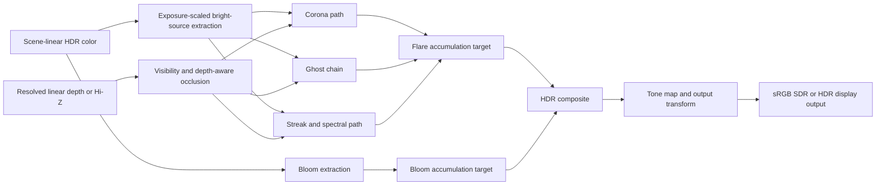
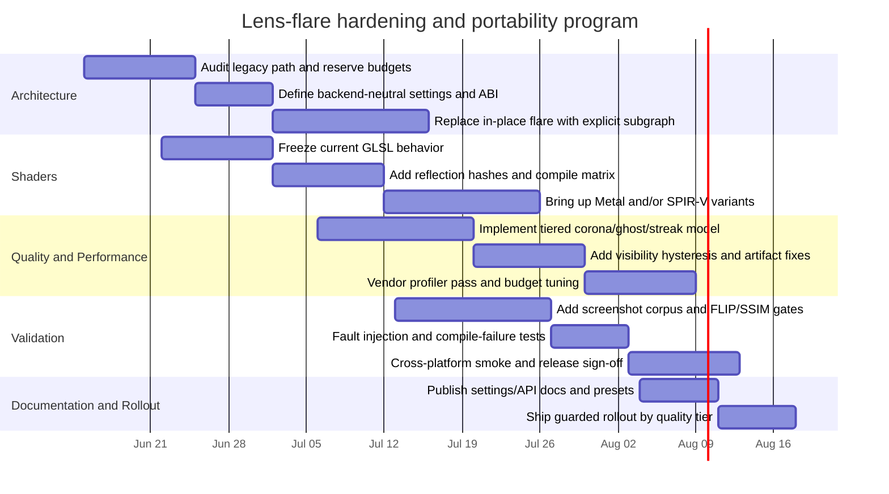

# Scrutiny Plan for a Robust Cross-Platform Lens-Flare Screen Effect

## Executive summary

The two GitHub repositories show a clear architectural split. `openQ4` is where the relevant renderer implementation lives, while `openQ4-GameLibs` is the companion SDK/game-library repository with Meson/Ninja build plumbing and a renderer subtree that is header-only in the inspected tree, not the place where a screen-space lens-flare implementation is materially executed. In `openQ4`, the engine already advertises FP16 HDR scene targets, multi-scale bloom, filmic tone mapping, log-average auto exposure, depth-aware lens flares, MSAA, and SMAA; however, the inspected internals show lens flare represented mainly as a distinct render-pass category and render-graph contract, while the modern GL executor still treats it as legacy post work rather than as a promoted modern shader family. That is the central gap: the effect exists conceptually and in frame-graph bookkeeping, but not yet as a fully modernized, fully observable, explicitly synchronized, cross-backend-safe implementation. citeturn37search0turn34view1turn32view0turn32view2turn19view0turn17view0

The most important repo-specific finding is that `RENDER_PASS_LENS_FLARE` currently reads scene depth and performs scene-color read/write in the render graph, while bloom and authored post already use explicit transient resources plus resolve-style steps. That strongly suggests lens flare is still modeled as an in-place post mutation, which is tolerable in an OpenGL legacy bridge but becomes a hazard in explicit APIs because it complicates barriers, resolves, MSAA handling, and screenshot determinism. The second key finding is observability: `ScenePackets` exposes pass/category infrastructure, but command-pass categorization explicitly names authored post, GUI, present, and special effects, not lens flare or bloom, which means flare-specific accounting is likely weaker than it should be. The third key finding is platform pressure: `openQ4`’s platform roadmap says Windows x64 is still the primary actively validated build target, Linux is SDL3-first, and macOS is packaged but remains constrained by a deprecated OpenGL stack capped at OpenGL 4.1. That makes macOS the forcing function for backend-neutral flare design. citeturn32view0turn35view2turn34view2turn25view0turn40search10

My recommended plan is therefore not “tune the shader first.” It is to first harden the effect as a backend-neutral, fail-closed, explicitly budgeted post pipeline with a stable public parameter API, explicit transient outputs, capability gating from renderer probes, automated screenshot regression, and offline multi-target shader compilation. After that foundation is in place, you can safely layer visual sophistication from a cheap corona path up through ghost/streak and spectral variants, with a clean split between artist-driven gameplay presets and optional physically informed cinematic/photo presets. That recommendation is aligned with the current `openQ4` modernization direction, its validation-matrix approach, Khronos/Microsoft/Apple shader tooling realities, and the original lens-flare literature. citeturn24view5turn23view2turn39search12turn39search1turn39search2turn38search3turn44search0

Assumptions used in this report are explicit. The target effect is assumed to be a screen-space camera-lens effect driven by HDR scene radiance and depth, not only billboard flare sprites. Target GPUs, engine backend mix, and shader authoring language were not specified, so the plan assumes a desktop spread ranging from current OpenGL shipping paths through possible future D3D12, Vulkan, and Metal backends, with macOS treated as the lowest-feature portability constraint because Apple deprecates OpenGL and `openQ4` itself documents a 4.1 cap there. citeturn25view0turn40search10turn40search8

## Implementation progress checklist

Updated: 2026-06-13.

- [x] Round 1: reserve explicit lens-flare post-process identity in scene packets, render graph resources, GPU timing, runtime budgets, and renderer validation self-tests.
- [x] Round 2: introduce a versioned, backend-neutral `LensFlareSettings` contract shared by packet scheduling and runtime draw code.
  - [x] Add the settings schema, capability gate, rejection reasons, and self-test coverage.
  - [x] Route scene-packet scheduling through the shared settings gate so unsupported flare requests fail closed before graph construction.
  - [x] Route runtime lens-flare draw setup through the shared settings snapshot and expose accepted tier/capability state in metrics.
  - [x] Update renderer validation/docs/release notes and run the Meson build, install, and focused renderer validation loop.
- [x] Round 3: replace the visible legacy in-place blend with an executor-visible accumulation/composite implementation that matches the graph-owned `lensFlareAccum` contract.
  - [x] Add runtime accumulation/composite targets and ownership checks that mirror the render-graph `lensFlareAccum` resource.
  - [x] Render flare elements into cleared accumulation storage before compositing into scene color.
  - [x] Expose accumulation/composite execution state in metrics and self-tests.
  - [x] Update validation/docs/release notes and rerun the Meson build, install, self-test, and SP smoke loop.
- [x] Round 4: promote lens flare into Shader Library V2 metadata and validation.
  - [x] Register lens-flare accumulation and composite shader kinds in the internal shader-library family list.
  - [x] Add GLSL source generation, sampler/reflection metadata, readiness stats, and self-test checks for the lens-flare shader family.
  - [x] Link the runtime lens-flare self-test and metrics/docs to the shader-library contract so compile/reflection regressions are visible.
  - [x] Update validation/docs/release notes and rerun the Meson build, install, self-test, and SP smoke loop.
- [x] Round 5: add lens-flare screenshot-diff capture scenes to the gameplay validation harness.
  - [x] Add lens-flare-specific SP capture scenes and off/corona/high quality presets.
  - [x] Make lens-flare quality a reportable benchmark dimension with optional TGA reference comparison.
  - [x] Update validation/docs/release notes with the new profile and deterministic capture workflow.
  - [x] Run the Meson build, install, foundation self-test, and a bounded lens-flare screenshot smoke capture.
- [x] Round 6: add backend shader compile/reflection coverage for the lens-flare shader family.
  - [x] Expose per-GLSL-tier lens-flare accumulation/composite program coverage and sampler reflection stats.
  - [x] Extend shader-library self-tests to verify lens-flare variants for every compiled GLSL tier, not only the highest tier.
  - [x] Add validation-matrix cases for forced GL 3.3/4.1/4.3/4.5/4.6 lens-flare shader coverage.
  - [x] Update validation/docs/release notes and rerun the Meson build, install, shader-tier validation, foundation self-test, and bounded lens-flare screenshot smoke capture.
- [x] Round 7: make cross-platform visual/performance sign-off a first-class validation profile.
  - [x] Add a `lensflare-signoff` gameplay benchmark profile for storage/outdoor flare scenes, off/corona/high presets, and auto/macOS-floor/low-overhead GL tier coverage.
  - [x] Add reportable Windows/Linux/macOS lens-flare sign-off criteria to gameplay and safe validation reports.
  - [x] Update validation docs/release notes with the sign-off workflow and platform evidence requirements.
  - [x] Rerun the Meson build, install, supported shader-tier validation, foundation self-test, and bounded lens-flare sign-off smoke capture.
  - [x] Record the local forced-GL-4.6 validation caveat: GL 3.3/4.1/4.3/4.5 lens-flare shader-tier cases pass, while `shader-lensflare-gl46` currently aborts after ARB2 initialization before self-test markers are emitted on this Windows host.

## Findings from the OpenQ4 repositories

The repository evidence is strong enough to frame the current state precisely. `openQ4` already has render-pass, scene-packet, metrics, platform, and validation scaffolding that a production lens-flare effect can and should reuse. `openQ4-GameLibs`, by contrast, is relevant mainly for build/integration boundaries and ABI discipline, not renderer execution. In the public trees I inspected, I did **not** identify a dedicated modern lens-flare shader-family source file; instead, I found pass enums, graph accesses, executor ownership logic, documentation, and public special-effects APIs that imply flare still lives on a legacy bridge path or a legacy-authored post path. citeturn37search0turn24view7turn32view2turn19view0turn17view0

| Repo | Files and functions inspected | What they show |
|---|---|---|
| `openQ4` | `README.md` via repo overview. citeturn37search0 | The engine publicly claims FP16 HDR scene targets, bloom, filmic tone mapping, auto exposure, and depth-aware lens flares with corona and ghost/streak modes, so the feature is meant to be integrated into a modern HDR post chain rather than treated as an isolated cosmetic add-on. citeturn37search0 |
| `openQ4` | `src/renderer/RenderSystem.h`, especially `ESpecialEffectType`. citeturn31view6turn20view0 | The public renderer special-effects API still exposes `SPECIAL_EFFECT_BLUR` and `SPECIAL_EFFECT_AL`, not a first-class lens-flare API, which suggests flare configuration is either elsewhere or not yet surfaced as a stable engine-level contract. citeturn31view6turn20view0 |
| `openQ4` | `src/renderer/RenderSystem.cpp`, especially `R_AddSpecialEffects`. citeturn32view1 | Special effects are submitted via command buffers, and portal-sky / negative-view-ID views are explicitly excluded. That is directly relevant to flare correctness: player-camera flare must not leak into subviews, portal skies, remote cameras, or replay/render-demo paths unless deliberately authored. citeturn32view1 |
| `openQ4` | `src/renderer/ScenePackets.h`, especially `renderPassCategory_t`. citeturn34view1 | Lens flare is already a named pass category beside SSAO, motion blur, bloom, authored post, GUI, and present. This is good: the feature already has a schedulable identity in the renderer architecture. citeturn34view1 |
| `openQ4` | `src/renderer/ScenePackets.cpp`, especially `R_ScenePackets_CategoryForDrawSurf`, `R_ScenePackets_CategoryForCommandPass`, `R_ScenePackets_PassUsesLegacySort`, and `R_ScenePackets_BuildSortKey`. citeturn35view2turn36view0 | Authored post is explicitly categorized as post-process, but lens flare and bloom are not given equivalent command-pass categorization in the inspected logic. That implies a telemetry and QA blind spot for flare-specific command-only post work. Also, lens flare does not get the authored-post legacy sort treatment, so multi-draw flare expansions should not rely on accidental ordering. citeturn35view2turn36view0 |
| `openQ4` | `src/renderer/RenderGraph.h` and `RenderGraph.cpp`, especially `RENDER_PASS_LENS_FLARE`. citeturn23view0turn32view0 | The render graph models lens flare as a scene-depth read plus scene-color read/write. Bloom and authored post use explicit transient resources and resolve-style writes instead. This is the clearest current robustness issue: replace in-place flare mutation with an explicit flare accumulation target and composite pass. citeturn32view0turn23view0 |
| `openQ4` | `src/renderer/ModernGLExecutor.cpp`, especially `R_ModernGLExecutor_PassName`, `R_ModernGLExecutor_PassHasLegacyWork`, `R_ModernGLExecutor_PassIsPost`, and `R_ModernGLExecutor_ResetPassOwnershipTable`. citeturn31view0turn32view2 | The modern executor knows the lens-flare pass by name, classifies it as post, and still flags it as pass content with legacy work. Ownership resets fail-closed to legacy defaults with a recorded reason. This is excellent defensive scaffolding, but it also confirms flare has not been promoted into the modern executor path. citeturn32view2 |
| `openQ4` | `src/renderer/RendererMetrics.h`. citeturn23view1 | The engine already has extensive renderer metrics and GPU timer infrastructure, but no dedicated lens-flare timer slot is visible in the inspected interface. Add one. Flare should become a first-class measured cost center. citeturn23view1 |
| `openQ4` | `docs-dev/gl-renderer-modernization.md`. citeturn24view3turn24view7 | Shader Library V2 currently enumerates depth, shadow, flat material, light-grid, fog/blend, GUI, post-copy, G-buffer, deferred resolve, clustered forward, and debug variants; there is no specifically called-out lens-flare shader family in the inspected milestone text. That matches the executor evidence that flare remains legacy. citeturn24view3turn24view7 |
| `openQ4` | `docs-dev/renderer-validation-matrix.md`. citeturn23view2 | The project already has the right validation philosophy: safe automated startup/self-test coverage plus separate smoke/gameplay validation. Lens flare should plug into that exact pattern with effect-correctness scenes and image-diff gates. citeturn23view2 |
| `openQ4` | `docs-dev/platform-support.md`. citeturn25view0 | Windows x64 is the primary actively validated target; Linux is SDL3-first; macOS packages exist but OpenGL is capped at 4.1 and deprecated. Any “professional-grade across Windows, Linux, and macOS” plan must therefore separate feature quality tiers from API/backend assumptions. citeturn25view0turn40search10 |
| `openQ4-GameLibs` | `README.md`, `src/`, and `src/renderer/`. citeturn17view0turn18view0turn19view0 | This repo is the companion SDK/game-library source with Meson/Ninja build flow. In the inspected renderer tree it exposes headers such as `RenderSystem.h`, `RenderWorld.h`, and GL headers, but not the engine-side implementation where a screen-space flare effect would actually be executed. This is an integration boundary, not the implementation home. citeturn17view0turn18view0turn19view0 |

The practical conclusion from the repo audit is simple: the next step is **not** to patch tiny shader details in place. The next step is to re-home flare into a well-defined HDR post subgraph with explicit inputs, outputs, metrics, categories, and failure behavior, because that is exactly where the repo’s current modernization scaffolding is strongest and exactly where the current flare path appears weakest. citeturn32view0turn32view2turn24view5turn23view2

## Audit and risk model

From a code-audit perspective, the effect should be treated as a multi-dimensional risk area: resource-lifetime risk, explicit-API hazard risk, cross-thread snapshot risk, and observability risk. The current repo already gives you several guardrails that should be adopted consistently: centralized capability probing in `glconfig`, command-buffer submission boundaries for special effects, fixed maximums in scene-packet and render-graph structures, and fail-closed modern-pass ownership reset logic. Those are good bones. The missing piece is to apply them specifically to flare rather than letting flare remain a partially implicit legacy path. citeturn20view0turn32view1turn23view0turn34view1turn32view2

| Audit area | Current evidence | Specific actionable recommendation | Test cases and metrics | Priority | Effort |
|---|---|---|---|---|---|
| Resource limits and memory safety | `RenderGraph` has fixed maxima for passes/resources/accesses, and `ScenePackets` has fixed pass/memory-oriented capacities. citeturn23view0turn34view1 | Put flare on an explicit pass budget: one source extraction pass, one optional occlusion/Hi-Z pass, one flare accumulation pass, one composite pass. Hard-cap ghost count, streak tap count, flare atlas dimensions, and transient target count. Reject or clamp any content/cvar values that would exceed those budgets. | Unit tests for config clamping; asserts that flare never increases total pass/resource counts beyond reserved caps; soak test with extreme user configs and modded presets; track peak transient memory in MiB. | High | Low |
| Frame ownership and threading | Special effects are submitted through frame-command buffers, and the renderer commentary explicitly discusses backend/front-end separation and double-buffering concerns. citeturn32view1turn22view0 | Snapshot all flare parameters into frame-local POD before submission. Never keep raw pointers into mutable material/script/UI state after command generation. If you cache analytic flare sources from visible lights, cache immutable copies of screen-space/light-space data per frame. | ThreadSanitizer on CPU-side tests; frame-replay determinism tests; command-stream hashing; repeated pause/resume/video-restart tests. | High | Medium |
| Explicit API misuse and synchronization | Lens flare currently reads scene depth and performs scene-color read/write in-place; bloom/authored post already use explicit transients and resolves. citeturn32view0 | Replace in-place mutation with `flareAccum` or `postFlare` transient output, then integrate with a single composite pass. In explicit backends, this removes self-read/write ambiguity and simplifies barriers, resolves, and image-layout transitions. | Frame-graph validation tests; RenderDoc/PIX captures verifying no overlapping read/write hazards; MSAA path tests with single-sample and multi-sample sources; no undefined-resource warnings in validation tools. | High | Medium |
| Observability and diagnostics | Lens flare is a pass category, but command categorization and metrics do not visibly expose a dedicated flare bucket in the inspected code. citeturn34view1turn35view2turn23view1 | Add `RENDERER_GPU_TIMER_LENS_FLARE`, flare packet counts, active-source counts, occlusion rejection counts, and per-quality-tier execution flags. Also add explicit scene-packet categorization for lens flare and bloom so they show up in post-process telemetry. | CI asserts that metrics fields exist and are serialized; performance dashboards plot flare cost by scene and preset; JSON log diff tests after refactors. | High | Low |
| Security and safety | Modern pass ownership already resets fail-closed to legacy defaults with a reason string; `glconfig` already exposes capability probes such as float buffers, sRGB, max texture size, and MRT count. citeturn32view2turn20view0 | Preserve a strict no-flare fallback on any capability miss, FBO allocation failure, shader compile failure, or invalid user config. Use API robustness features where available: `KHR_robustness`/`ARB_robustness` for GL, validation layers plus robustness2 for Vulkan. | Compile-failure fault injection; simulated OOM on transient targets; malformed/NaN preset ingestion; API validation must remain clean; zero crashes allowed under failure injection. | High | Medium |

A robust implementation should build the flare effect exactly the same way you would build a safety-critical optional renderer feature: capability-gated, explicitly budgeted, immutable after submit, and able to disappear without destabilizing the rest of the frame. OpenGL robustness extensions were created partly to reduce the danger of unsafe API interactions and out-of-bounds query/write patterns, and Vulkan’s robustness2 and validation-layer guidance exist for the same reason in more explicit form. Those are directly relevant here because flare code often sits in the part of the renderer most tempted to “just sample one more thing” or “just allocate a small scratch texture.” citeturn43search1turn43search0turn42search2turn42search0turn42search13

The cleanest fail-closed pattern is a small validated config object plus an explicit build function that refuses to schedule passes when safety preconditions are not met:

```cpp
struct LensFlareConfig {
    uint32_t maxSources;          // e.g. 32
    uint32_t ghostCount;          // e.g. <= 8
    uint32_t streakSamples;       // e.g. <= 64
    float thresholdEV;            // finite, clamped
    float intensity;              // finite, >= 0
    float chromaticDispersion;    // finite, clamped
    bool depthAware;
    bool spectralMode;
};

bool ValidateLensFlareConfig(LensFlareConfig& c, const Caps& caps) {
    c.maxSources         = std::min(c.maxSources, 32u);
    c.ghostCount         = std::min(c.ghostCount, 8u);
    c.streakSamples      = std::min(c.streakSamples, 64u);
    c.thresholdEV        = ClampFinite(c.thresholdEV, -16.0f, 16.0f, 0.0f);
    c.intensity          = ClampFinite(c.intensity,  0.0f, 64.0f, 1.0f);
    c.chromaticDispersion= ClampFinite(c.chromaticDispersion, 0.0f, 0.2f, 0.0f);

    if (!caps.hdrColor || !caps.linearSampling) return false;
    if (c.depthAware && !caps.depthTextureRead) return false;
    if (c.spectralMode && !caps.highQualityFlare) c.spectralMode = false;
    return true;
}

void BuildLensFlare(FrameGraph& fg, const FrameInputs& in, LensFlareConfig cfg) {
    if (!ValidateLensFlareConfig(cfg, in.caps))
        return; // fail closed: no flare, stable frame

    auto flareAccum = fg.CreateTransientColor("flareAccum", in.postExtent, Format::RGBA16F);
    // extraction, optional occlusion, accumulation, composite...
}
```

That pattern is not just tidy; it is exactly what the repo’s modernization work already suggests you should be doing, and it is what explicit APIs reward operationally. citeturn20view0turn32view2turn42search2turn43search1

## Shader and pipeline portability plan

The correct integration target for a professional lens-flare effect is an **HDR, scene-linear post subgraph** that runs after the scene/exposure state needed to decide brightness is known, but before the final display transform. In practice, the most stable approach is to derive flare and bloom from a shared HDR source in exposure-scaled linear light, composite them back into an HDR/intermediate scene buffer, then perform tone mapping and the final output transform once. That is also the only sane way to keep flare behavior visually coherent with bloom, auto exposure, and color transforms in an engine that already advertises FP16 HDR, tone mapping, and bloom. citeturn37search0turn45search0turn45search6



The other key recommendation is architectural rather than visual: make flare shader logic **backend-neutral first, language-specific second**. That means one parameter schema, one reflection schema, one golden set of test scenes, and one capability matrix, regardless of whether a given backend consumes GLSL, DXIL/HLSL, SPIR-V, or MSL. The following comparison table is the practical portability picture.

| Shader form | Best role in this plan | Precision and derivative facts | Portability hazards | Windows | Linux | macOS |
|---|---|---|---|---|---|---|
| GLSL for OpenGL | Keep for current `openQ4` shipping path and legacy/bridge validation. `openQ4`’s modern shader docs already target GLSL 330 with optional 410/430/450 tiers. citeturn24view3 | `dFdx`/`dFdy` and coarse/fine derivative variants exist in desktop GLSL/OpenGL, but derivative-sensitive code should be minimized for flare because aliasing and backend differences are hard to regression-test at scale. citeturn38search4turn48search9 | macOS OpenGL is deprecated and capped at 4.1; do not build your highest-quality flare tier around GL 4.3+/4.5 assumptions if macOS parity matters. citeturn25view0turn40search10 | Viable | Viable | Reduced-feature only |
| HLSL targeting DXIL | Strong candidate if a D3D12 backend becomes first-class. | `ddx`, `ddy`, and `fwidth` are pixel-shader-only. `min16float` is only a **minimum-precision hint**, while `float16_t` requires `-enable-16bit-types` and suitable hardware support. citeturn41search1turn41search16turn41search2turn41search0turn41search13 | Resource binding semantics differ strongly from GL; bind-layout generation and reflection checks are mandatory. citeturn41search11 | First-class | No native D3D path | No native D3D path |
| HLSL compiled to SPIR-V | Best single-source route if Vulkan becomes a major backend. DXC is the reference HLSL→SPIR-V compiler in Vulkan guidance. citeturn39search12turn39search1 | Use 32-bit for source selection, exposure, and accumulation; allow 16-bit only in validated low-risk data paths. SPIR-V supports the IR side of this, but you still need backend capability checks. citeturn38search2turn41search0turn41search13 | On macOS, Vulkan portability must be treated as a portability-subset target class, not assumed equivalent to native Vulkan. citeturn38search1turn42search13 | Strong | Strong | Conditional |
| SPIR-V as IR | Excellent interchange and validation target; not recommended as the human-authored source of truth. citeturn38search2turn38search10 | Good place for reflection, binding validation, and capability checks. | Still needs backend-specific qualifiers, validation, and portability policy. citeturn42search0turn42search12 | Strong | Strong | Conditional |
| Metal Shading Language | Long-term first-class target for macOS. Apple explicitly positions Metal as the path forward and provides feature-family tables and MSL spec. citeturn39search2turn40search8turn40search2turn40search16 | MSL provides explicit fragment derivative functions and explicit scalar types such as `half`/`float`; use that explicitness rather than “portable guesswork.” citeturn39search2turn48search1 | Requires a distinct backend qualification path and Xcode/Metal frame-capture validation. citeturn46search15turn40search11 | No native target | No native target | First-class target |

The near-term authoring strategy I recommend is this. Keep GLSL as the maintained implementation for the current OpenGL path because that is what `openQ4` already knows how to validate, tier, and ship. In parallel, define a backend-neutral flare parameter schema and test corpus, and—if broader backend work is planned—move toward a single semantic source for newer backends, with HLSL→DXIL and HLSL→SPIR-V as the most practical pair, and MSL as an independently compiled target for macOS. That avoids the worst possible middle ground, which is hand-maintaining several visually similar but behaviorally divergent flare shaders across APIs. citeturn24view3turn39search12turn39search1turn39search2

A minimal backend-neutral parameter contract should be explicit about color space, exposure domain, and backend-visible binding layout:

```cpp
struct LensFlareFrameParams {
    float2 invSourceExtent;      // source HDR buffer texel size
    float2 opticalAxisNDC;       // usually (0,0), but support off-center lensing
    float exposureScale;         // same exposure used by bloom / pre-tonemap composite
    float threshold;             // scene-linear or exposure-scaled threshold; choose one
    float intensity;
    float ghostDispersal;
    float streakIntensity;
    float aspectRatio;
    uint  activeSourceCount;
    uint  qualityTier;           // 0 corona, 1 ghosts, 2 streaks, 3 spectral
    uint  flags;                 // bitset: depthAware, dirtMask, anamorphic, etc.
};
```

Use 32-bit precision for all thresholding, source ranking, exposure, and accumulation control. Only demote **weights** or **auxiliary taps** when the backend semantics are explicit and validated. HLSL minimum-precision hints are not a safe portability contract by themselves, and derivative functions are fragment/pixel-stage constructs across HLSL and MSL, which is another reason to keep source extraction, ranking, and many occlusion decisions out of derivative-sensitive shader code if you want consistent cross-backend behavior. citeturn41search2turn41search0turn41search1turn41search16turn39search2

## Visual quality and performance plan

Visually, the right answer is **dual-track**. For gameplay, use an artist-driven flare model with physically informed constraints: stable corona, tempered ghost chain, optional streaks, restrained chromatic dispersion, and strong depth-aware visibility. For cinematic/photo mode, optionally expose a more physically grounded model influenced by Hullin et al.’s real-time lens-flare work. Do **not** make the whole shipped effect fully physically based by default. That tends to be more expensive, harder to direct artistically, and less legible during gameplay. Spencer et al. is still useful as a perceptual reference for halo/streak appearance, but it models human-eye glare, not camera-lens flare, so it should inform look-dev carefully rather than be treated as a direct camera model. citeturn38search3turn38search11turn44search0turn37search0

| Area | Specific recommendations | Test cases and metrics | Priority | Effort |
|---|---|---|---|---|
| Source selection and occlusion | Drive flare from HDR bright-source selection after exposure is known, not from LDR post-tonemap pixels. Rank candidate sources by exposure-scaled luminance, screen size, and visibility. Use depth-aware visibility with hysteresis or temporally damped visibility so sources do not pop when grazing geometry, smoke, or alpha-tested foliage. Reuse or extend existing scene-depth / Hi-Z infrastructure where available. citeturn37search0turn32view0turn23view1turn24view5 | Regression scenes: bright emitter moving behind a pole, behind alpha-tested chain-link, behind volumetric smoke, and behind first-person weapon geometry. Track visible-source count, visibility stability, and per-source centroid drift. | High | Medium |
| Ghosts, streaks, and artist control | Ship three tiers: **Low** = corona only; **Medium** = corona + bounded ghost chain; **High** = add streaks and mild color dispersion. Keep anamorphic streaking opt-in and lens-preset-driven. Never tie gameplay visibility to a top-end-only effect. citeturn37search0turn38search3 | Visual sign-off scenes for sun-at-edge, point lights in dark hallways, weapon muzzle flashes, and multi-emitter combat. Measure per-tier GPU cost and source count. | High | Medium |
| Spectral scattering and chromatic aberration | If you expose a physically informed mode, use subtle wavelength-separated sampling or a compact spectral lookup only for ghost/streak paths, not for the entire corona. Clamp saturation growth before tone mapping so flare reinforces highlight bloom without creating impossible neon clipping. ACES-style scene/display separation helps here. citeturn38search3turn45search0turn45search6 | Compare SDR and HDR output captures; monitor hue drift for white and near-white sources; maintain bounded chroma error in screenshot tests. | Medium | Medium |
| Pipeline ordering | Use scene-linear HDR inputs, resolve MSAA before flare unless you have a very deliberate per-sample design, and do final tone mapping/output transform once after flare and bloom are composited. Keep all flare math in linear light. If you need a dirt mask, keep it in the flare-composite stage, not in source extraction. citeturn37search0turn32view0turn45search0turn45search6 | Test matrix: MSAA off/on, screen-fraction scaling, SMAA path, sRGB on/off at output, auto-exposure adaptation, subviews/portal skies. | High | Medium |
| Artifact prevention | Eliminate shimmer by quantizing or filtering source positions below a size threshold; eliminate halo leaks by masking with conservative depth-aware visibility; eliminate temporal pumping by using hysteresis in source ranking and ghost amplitude. Avoid using derivatives for logic where explicit gradients or analytic UVs suffice. citeturn41search1turn41search16turn48search9 | Automated scene camera rails with FLIP and SSIM, plus manual review for shimmer, single-pixel popping, ringing, and edge leaks. citeturn44search2turn44search17 | High | Medium |
| Performance and profiling | Put flare on a hard proposed budget per preset and resolution, then validate on vendor tools. Use one cross-API debugger (RenderDoc), one Windows D3D12 profiler (PIX), one NVIDIA profiler (Nsight Graphics), one AMD profiler (RGP), and Xcode capture on Metal. Also extend `openQ4`’s renderer metrics with a dedicated flare timer and counters. citeturn47search2turn46search17turn46search9turn46search2turn46search6turn46search3turn46search15turn23view1 | Proposed starting budgets: Low ≤ 0.3 ms at 1440p, Medium ≤ 0.8 ms, High ≤ 1.5 ms on your reference mid-range desktop GPU. Treat these as calibration targets, not universal truths. Also track CPU submission cost, transient memory, and source cull efficiency. | High | Medium |

A production-quality source-selection loop can stay very simple and still behave much better than a naïve screen-threshold implementation:

```cpp
for (Source s : brightSources) {
    if (s.screenRadiusPx < 2.0f) continue;
    if (!s.onScreen) continue;

    float vis = SampleVisibility(s);         // depth-aware, optionally temporally filtered
    if (vis < 0.05f) continue;

    QualityTier q = SelectTier(s.screenRadiusPx, preset, gpuTier);
    EmitCorona(s, vis);

    if (q >= Medium) EmitGhostChain(s, vis);
    if (q >= High)   EmitStreaksAndDispersion(s, vis);
}
```

On the quality side, the most useful visual rule is this: **make small sources stable, not dramatic**. Tiny bright emitters should mostly get a controlled corona and perhaps one or two very soft ghosts. The big cinematic look should come from large, sustained, high-exposure sources. That is how you preserve professional-grade appearance rather than getting “lens flare everywhere.” Hullin’s work justifies the richer optical end of the space; `openQ4`’s own README suggests the project already conceptually separates lightweight corona from higher-quality ghost/streak paths, which is exactly the right tiering model. citeturn38search3turn37search0

## Testing, build, deployment, and roadmap

`openQ4` already has two excellent process patterns that should be applied directly to flare hardening: first, the renderer-validation matrix separates safe automated checks from manual gameplay smoke tests; second, the build/stage flow is Meson/Ninja-based and already supports CI-style staged installs and validation wrappers. `openQ4-GameLibs` also reinforces the need to keep engine/game boundaries clean. The flare plan should therefore add backend shader compilation, targeted screenshot-diff scenes, capability-matrix probes, and fault injection to the existing build-and-validate culture instead of inventing a side workflow. citeturn23view2turn37search0turn17view0

| Area | Specific actionable recommendations | Test cases and metrics | Priority | Effort |
|---|---|---|---|---|
| Testing and QA | Add unit tests for parameter validation/clamping; integration tests for frame-graph ordering and capability gating; visual regression for curated flare scenes; manual sign-off for gameplay readability; and fault-injection tests for shader compile failure and transient-allocation failure. Base objective image diffs on FLIP plus SSIM, with stable warm-up/capture sequencing. citeturn23view2turn44search2turn44search17 | Starting thresholds: mean FLIP < 0.03 and SSIM > 0.995 for deterministic opaque scenes; relax slightly for scenes with temporal effects or smoke. Calibrate by backend/vendor. | High | Medium |
| Build and CI | Compile every flare variant in CI on every supported backend path. For Vulkan use DXC HLSL→SPIR-V or your chosen reference path; for Metal compile MSL on macOS runners; for OpenGL keep startup/self-test shader validation and runtime tier probes like `openQ4` already does. Hash reflected resource layouts and fail CI on drift without an interface version bump. citeturn39search12turn39search1turn39search2turn24view3turn23view2 | CI matrix by OS/API/GPU vendor where possible; 100% shader compile success; zero unreviewed reflection drift; staged runtime package validation after install. | High | Medium |
| Documentation and API design | Introduce a versioned `LensFlareSettings` schema with defaults, clamp ranges, color-space expectations, quality tiers, and failure semantics. Document whether thresholds are scene-linear or exposure-scaled; document pass order relative to bloom, authored post, BSE screen/camera effects, GUI, and present. Keep artist presets separate from backend capability fallback data. citeturn37search0turn32view1turn24view7 | API docs reviewed in the same PR as code; sample captures for each quality tier; unit tests for backward-compatible settings deserialization. | High | Low |
| Deployment and rollout | Ship flare in tiers, not as one monolith. On current macOS/OpenGL 4.1, default to a reduced feature tier if necessary. Treat any Vulkan-on-macOS future path as portability-subset-qualified and separately tested. Preserve a kill-switch for flare independent of the rest of HDR/bloom. Keep fallback output visually neutral rather than “broken but on.” citeturn25view0turn40search10turn38search1 | Release checklist: startup probes clean, no validation faults, no compile failures, capture-based sign-off on each platform, no regression in screenshot diff corpus. | High | Medium |
| Cross-platform deployment tooling | Use RenderDoc for OpenGL/Vulkan/D3D capture parity, PIX for D3D12 deep dives, Nsight/RGP for vendor-specific bottlenecks, and Xcode Metal captures on macOS. Use Vulkan validation layers and OpenGL debug/robustness hooks in development builds. citeturn47search2turn46search17turn46search2turn46search3turn46search15turn42search13turn43search2turn43search0 | “No hidden warnings” criterion: debug builds may not emit unreviewed API validation messages on flare scenes. | Medium | Low |

The implementation program below assumes a staged rollout starting on June 15, 2026, which is consistent with the current build/validation posture in the repo and aggressive enough to deliver meaningful risk reduction before large back-end expansion. citeturn23view2turn25view0



The final integration checklist should be treated as a release gate rather than as “best effort.” If any row is incomplete, the flare effect should stay opt-in or fail closed.

| Area | Integration checklist |
|---|---|
| Code audit | ☐ All flare settings are finite and clamped. ☐ No unbounded per-frame allocations. ☐ No raw mutable pointers survive submission. ☐ Explicit reserved pass/resource budget exists. |
| Shader correctness and portability | ☐ Every shipping variant compiles in CI. ☐ Reflection hashes match expected layouts. ☐ 32-bit precision is used for source ranking, exposure, and accumulation control. ☐ Derivative-dependent code is isolated and justified. |
| Rendering pipeline integration | ☐ Flare uses HDR linear inputs. ☐ MSAA path is explicitly resolved or intentionally per-sample. ☐ Final tone mapping/output transform occurs once after flare+bloom composite. ☐ sRGB/HDR output path is documented and tested. |
| Performance | ☐ Dedicated flare GPU timer exists. ☐ Active-source count and cull-reason counters exist. ☐ Proposed budget is met on each preset on reference hardware. ☐ Capture-based vendor profiling has been performed. |
| Visual quality | ☐ Corona/ghost/streak tiers are stable. ☐ Occlusion popping is damped. ☐ Chromatic dispersion is restrained. ☐ Small-source behavior is conservative. ☐ Photo/cinematic mode is separated from gameplay defaults. |
| Cross-platform compatibility | ☐ Windows, Linux, and macOS all have tested fallback tiers. ☐ macOS reduced-feature policy is explicit if OpenGL remains the path. ☐ Portability-subset Vulkan is handled as its own qualification class if introduced. |
| Testing and QA | ☐ Unit, integration, image-diff, and fault-injection tests exist. ☐ FLIP/SSIM thresholds are calibrated per backend. ☐ Manual gameplay scenes are signed off. ☐ Subviews/portal skies/remote cameras do not inherit unintended flare. |
| Security and safety | ☐ Shader compile failure yields safe no-flare fallback. ☐ Allocation failure yields safe no-flare fallback. ☐ API validation runs clean in debug builds. ☐ Robustness/debug hooks are enabled in development builds. |
| Build and CI | ☐ Flare compilers run on all target runners. ☐ Staged install validation covers flare assets and presets. ☐ Reflection/layout drift is versioned. |
| Documentation and deployment | ☐ Public settings schema is versioned. ☐ Presets are documented by visual intent and GPU tier. ☐ A runtime kill-switch exists. ☐ Release notes mention known platform differences. |

If I had to compress the whole report into one implementation rule, it would be this: **promote lens flare from an implicitly legacy post effect into an explicitly owned HDR subgraph before chasing “better-looking” ghosts or streaks**. The repo evidence says the engine is already ready for that move architecturally; the platform evidence says cross-platform quality will remain fragile until you make it. citeturn32view0turn32view2turn24view7turn25view0
